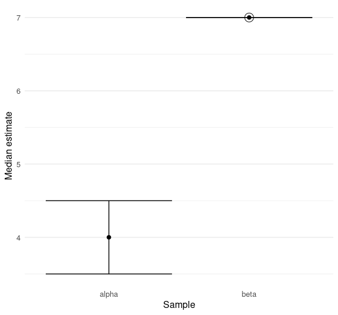
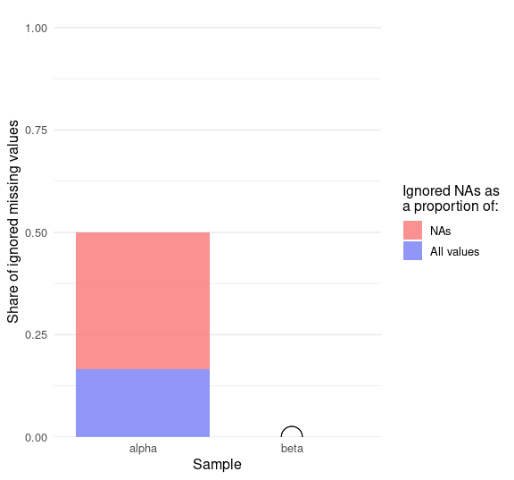

<!-- README.md is generated from README.Rmd. Please edit that file -->

# Median with missing values analysis

<!-- badges: start -->
<!-- badges: end -->
<!-- -->

The goal of naidem is to compute the median in a way that handles
missing values properly: checking whether `NA`s render the median
unknown and quantifying uncertainty arising from them. It contains:

- `median2()` as a drop-in replacement for `median()`. It returns `NA`
  if and only if the median can’t be determined from the data.
- `median_table()` to quantify uncertainty around a median estimate. It
  only ignores as many `NA`s as needed, not simply all of them. The
  output includes the lower and upper bounds of the median, how many
  `NA`s had to be ignored, etc.
- `median_plot_errorbar()` and other follow-up visualizations.

## Installation

You can install the development version of naidem like so:

``` r
remotes::install_github("lhdjung/naidem")
```

## Get started

``` r
library(naidem)
```

Base R’s `median()` function returns `NA` whenever the input vector
contains one or more `NA`s. In many cases, missing values do make it
impossible to compute the median. Yet some distributions have a clear
median even so:

``` r
alpha <- c(3, 4, 4, 5, NA, NA)
beta <- c(6, 7, 7, 7, NA)

median(alpha)
#> [1] NA
median(beta)
#> [1] NA
```

The actual median of `beta` is 7, irrespective of the true value behind
`NA`. Use `median2()` to distinguish between these cases:

``` r
median2(alpha)
#> [1] NA
median2(beta)
#> [1] 7
```

Compare this to `NA^0`, which returns `1` even though `NA^2` returns
`NA`. This also makes `NA` more meaningful when it is returned: users
can be sure that the median really is unknown. See [*Implementing the
algorithm*](https://lhdjung.github.io/naidem/articles/algorithm.html)
for more information on naidem’s solution.

What to do if the median really is unknown, like above? Call
`median_table()` to get a sense of the uncertainty around the median of
the known values:

``` r
df1 <- median_table(list(alpha = alpha, beta = beta))
df1
#> # A tibble: 2 × 10
#>   term  estimate certainty lower upper na_ignored na_total rate_ignored_na
#>   <chr>    <dbl> <lgl>     <dbl> <dbl>      <int>    <int>           <dbl>
#> 1 alpha        4 FALSE       3.5   4.5          1        2             0.5
#> 2 beta         7 TRUE        7     7            0        1             0  
#> # ℹ 2 more variables: sum_total <int>, rate_ignored_sum <dbl>
```

Visualize the lower and upper bounds of the median estimate using
`median_plot_errorbar()`:

``` r
median_plot_errorbar(df1)
```



The precise value of `alpha` is unknown, but it is bound to fall between
the bars. Since the median of `beta` is known, its bars are not
expanded, and it is marked as certain by a ring around its point.

Also, `median_table()` counts how many missing values need to be ignored
to determine the median of the remaining values. This balances the need
for knowledge about the central tendency with an appreciation of its
uncertainty.

Make it apparent with `median_plot_col()`. No bars are shown for `beta`
because its `NA` does not need to be ignored:

``` r
median_plot_col(df1)
```



## About this package

“naidem” is “median” backwards, but it also expresses the goal of
treating `NA` in the same (*idem*) conceptual way as R language
primitives like `^` do. Note that naidem is not about imputation at all,
but simply about determining the median.

The [moder](https://github.com/lhdjung/moder) package serves a similar
purpose, but for the mode instead of the median. Working on moder
provided the impetus behind naidem.
